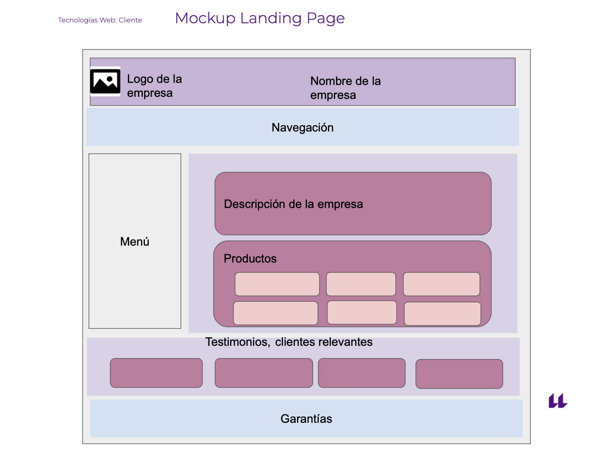
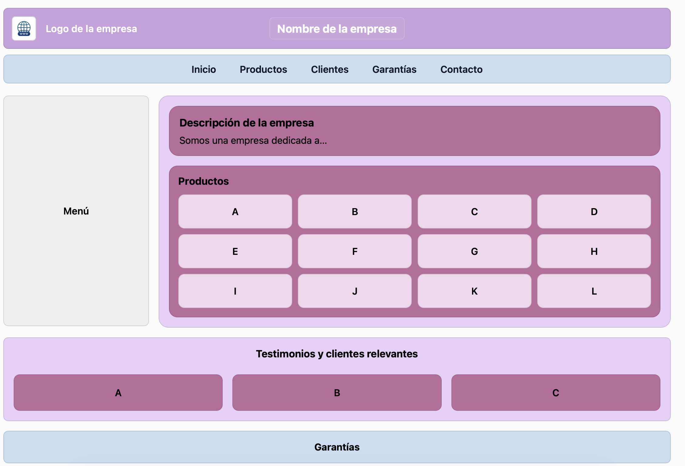

# 🌐 Práctica Intro Sass 2025

Este proyecto reproduce el **mockup de una landing page** usando **HTML + Sass** con especial énfasis en **CSS Grid** y **Flexbox**, tal como se pide en la práctica de la asignatura *Tecnologías Web: Cliente*.  

El objetivo es demostrar cómo **Grid organiza la macroestructura** (layout principal) y **Flexbox alinea micro-elementos** (contenido interno de tarjetas, navegación, etc.) además de aplicar los conocimientos adquiridos sobre **Sass**

---

## 📸 Mockup de referencia



> ⚠️ *Imagen del mockup propuesto en la práctica*

---

## 📸 Resultado final de la práctica



> 🎯 *Resultado final obtenido*

---

## 📂 Estructura del proyecto

```
.
├── css
│   ├── style.css
│   └── style.css.map
├── img
│   └── logo.jpg
├── index.html
└── scss
    ├── _mixins.scss
    ├── _variables.scss
    ├── base
    │   └── _base.scss
    ├── layout
    │   ├── _header.scss
    │   ├── _main.scss
    │   └── _navbar.scss
    └── main.scss

6 directories, 11 files
```

---

## 🛠️ Tecnologías usadas

- **HTML5** para la estructura.  
- **Sass (SCSS)** para modularidad y reuso:  
  - `variables` → colores, espaciados, tipografía.  
  - `mixins` → utilidades.  
  - `base` → reset y estilos globales.  
  - `layout` → secciones (`header`, `navbar`, `main`).  
- **CSS Grid** para la estructura principal (header, layout con menú lateral, productos, testimonios).  
- **Flexbox** para centrado y alineación interna (logo, nav-items, tiles, etc.).

---

## 🚀 Cómo ejecutarlo

1. Clona este repositorio:
   ```bash
   git clone https://github.com/CelesteLD/saas-webapp.git
   ```

2. Instala Sass (si no lo tienes):
   ```bash
   npm install -g sass
   ```

3. Compila Sass en tiempo real:
   ```bash
   sass --watch scss/main.scss css/style.css
   ```

4. Abre `index.html` con **Live Server** en VS Code para ver la página en el navegador.

---

## ✨ Resultado esperado

Una landing page con:  
- Header morado con logo a la izquierda y nombre centrado.  
- Barra de navegación.  
- Menú lateral.  
- Sección de descripción y productos enmarcados.  
- Tarjetas internas de productos/testimonios.  
- Barra de garantías.  

---

## 📑 Notas

- El directorio `css/` está ignorado en Git (`.gitignore`), solo se compila en local.  
- Se recomienda mantener la estructura modular de Sass para escalar fácilmente.  
