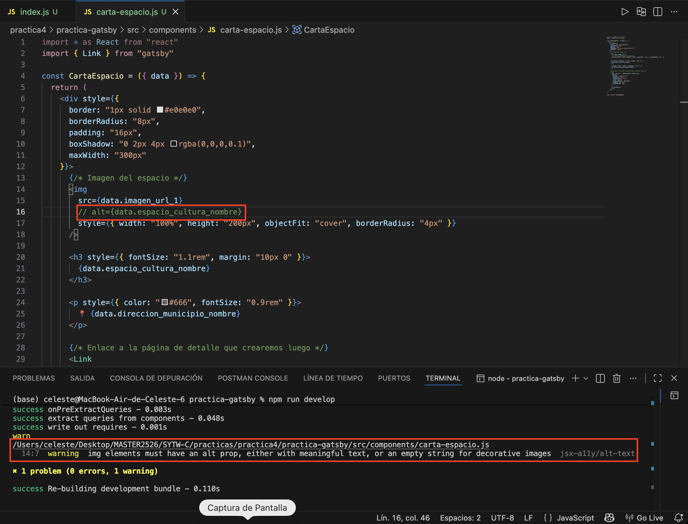
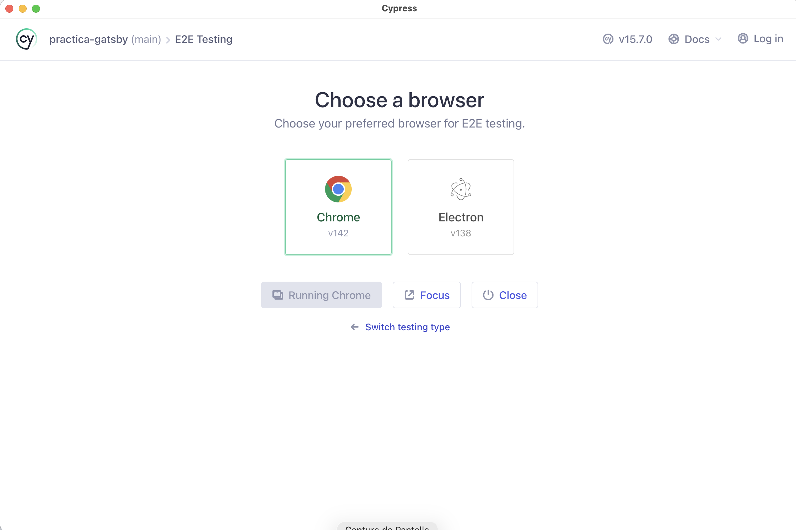
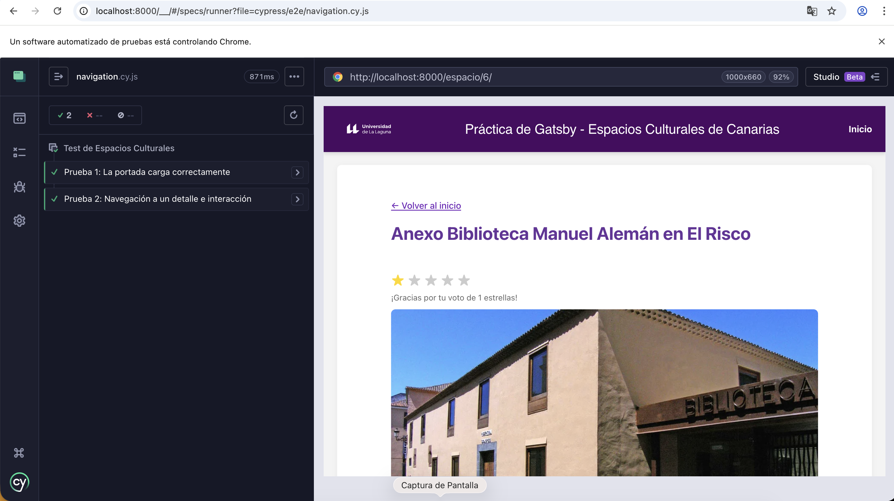

# Práctica Gatsby: Espacios Culturales de Canarias

**Asignatura:** Sistemas y Tecnologías Web: Cliente  
**Máster en Ingeniería Informática** **Escuela Superior de Ingeniería y Tecnología - ULL**

---

## 1. Descripción del Proyecto
Este proyecto consiste en el desarrollo de un sitio web estático siguiendo la arquitectura **JAMStack**, utilizando **Gatsby** como generador de sitios estáticos (SSG).

El objetivo principal ha sido crear un prototipo de página informativa sobre espacios culturales, consumiendo datos desde una API externa e implementando una arquitectura basada en componentes reutilizables (Micro-frontends).

## 2. Arquitectura y Gestión de Datos

### Consumo de API y GraphQL
Tal y como se especifica en el guion, no se han utilizado datos locales hardcodeados. La información se recupera dinámicamente durante el proceso de construcción (*build time*) desde una API externa.

* **Fuente de datos:** `https://cdn.jsdelivr.net/gh/celesteld/espacios-culturales-api@main/db.json`
* **Implementación:** Se ha configurado el archivo `gatsby-node.js` utilizando la API `sourceNodes` para realizar un *fetch* de los datos e inyectarlos en la capa de datos de Gatsby (Data Layer).
* **Consultas:** Los componentes recuperan esta información mediante consultas **GraphQL**.

### Generación Dinámica de Páginas
Para cumplir con el requisito de creación automática de páginas, se ha implementado la API `createPages` en `gatsby-node.js`.
* El sistema recorre todos los nodos de tipo `EspacioCultural` existentes en GraphQL.
* Genera una URL amigable basada en el ID original del recurso (ej: `/espacio/6`).
* Utiliza una plantilla (`src/templates/plantilla-espacio.js`) para renderizar la vista de detalle.

## 3. Componentes (Micro-frontends)
Siguiendo las directrices de la práctica sobre la reutilización de código, se han desarrollado los siguientes componentes independientes:

* **`Layout`**: Componente contenedor que define la estructura común (encabezado y pie de página) y utiliza la prop `children` para inyectar el contenido.
* **`CartaEspacio`**: Micro-frontend utilizado en la página de inicio para mostrar un resumen (imagen, título y enlace) de cada espacio cultural.
* **`Noticias`**: Componente que simula la carga de noticias relacionadas con el espacio cultural.
* **`Valoracion`**: Componente visual que representa la puntuación de los usuarios mediante un sistema de estrellas.

## 4. Imágenes y Optimización
Se han utilizado dos estrategias para la gestión de imágenes:
1.  **Imágenes estáticas:** Se ha implementado el componente `<StaticImage />` en la página de inicio para el banner principal, aprovechando la optimización automática de Gatsby.
2.  **Imágenes dinámicas:** Para las fotografías de los espacios, que provienen de URLs externas (API), se utiliza la etiqueta estándar `` renderizada dinámicamente.

## 5. Calidad y Pruebas

### Accesibilidad
Se ha verificado la accesibilidad del sitio utilizando el plugin `eslint-plugin-jsx-a11y`. Como prueba de concepto solicitada en la práctica, se forzó un error eliminando la etiqueta `alt` de una imagen para comprobar que el sistema de auditoría informaba correctamente de la incidencia.


*Figura 1: Captura de la terminal mostrando el warning de accesibilidad detectado.*

#### *¿Por qué falla?*
Gatsby ya viene con un "chivato" (ESLint) que nos avisa si nuestra web no es accesible para personas ciegas. Por esta razón muestra el siguiente mensaje:

*warning img elements must have an alt prop, either with meaningful text, or an empty string for decorative images jsx-a11y/alt-text*

### Tests E2E con Cypress
Se han implementado pruebas End-to-End (E2E) utilizando **Cypress** para asegurar la estabilidad del flujo crítico de la aplicación.

#### *Pasos llevados a cabo para realizar los tests*
1. Instalación de la librería Cypress:
`npm install cypress --save-dev`
2. Abrir Cypress por primera vez para que cree la estructura de directorios necesaria:
`npx cypress open`
3. Configuración finalizada:

4. Configuración del fichero navigation.cy.js:
````
describe('Test de Espacios Culturales', () => {
  
  beforeEach(() => {
    cy.visit('http://localhost:8000/')
  })

  it('Prueba 1: La portada carga correctamente', () => {
    cy.get('h1').should('contain', 'Espacios Culturales')
    cy.get('main').find('img').should('have.length.at.least', 1)
  })

  it('Prueba 2: Navegación a un detalle e interacción', () => {
    // 1. Navegar
    cy.contains('Ver detalles').first().click()

    // 2. Verificar URL y Título
    cy.url().should('include', '/espacio/')
    cy.get('h1').should('exist')
     
    // Buscamos el texto inicial del componente de valoración
    cy.contains('Haz clic en las estrellas para valorar').should('be.visible')

    // Buscamos la primera estrella y hacemos clic en ella
    cy.get('div').contains('★').click()

    // Verificamos que el texto cambia para dar las gracias
    // Esto confirma que tu useState y localStorage están funcionando
    cy.contains('Gracias por tu voto').should('be.visible')
  })
})
````
Los tests realizados (`navegacion.cy.js`) verifican:
1. <strong>Carga inicial y Renderizado:</strong> Verifica que la página de inicio (/) carga correctamente y que el título principal `<h1>` contiene el texto "Espacios Culturales".

2. <strong>Carga de Datos (API):</strong> Comprueba que se renderiza al menos una tarjeta de espacio cultural (buscando imágenes dentro del contenedor `<main>`), lo que confirma que la conexión con la API y la generación de componentes funcionan.

3. <strong>Navegación:</strong> Simula el clic del usuario en el primer botón "Ver detalles" y valida que la URL cambia correctamente a una ruta que incluye /espacio/.

4. <strong>Renderizado de Vistas Dinámicas:</strong> Confirma que en la página de detalle existe un título `<h1>`.

5. <strong>Estado Inicial de Componentes Interactivos:</strong> Verifica que el componente de valoración muestra el texto por defecto ("Haz clic en las estrellas para valorar").

6. <strong>Interactividad y Persistencia:</strong> Simula un clic en las estrellas de valoración y valida que la interfaz reacciona mostrando el mensaje de confirmación ("Gracias por tu voto"), asegurando el correcto funcionamiento de los Hooks de React (useState y localStorage).


*Figura 2: Ejecución exitosa de los tests en Cypress.*

## 6. Instalación y Ejecución

Para desplegar el proyecto en local es necesario disponer de Node.js (v18 o superior).

```bash
# 1. Instalar dependencias
npm install

# 2. Iniciar el servidor de desarrollo
npm run develop

# 3. Iniciar 